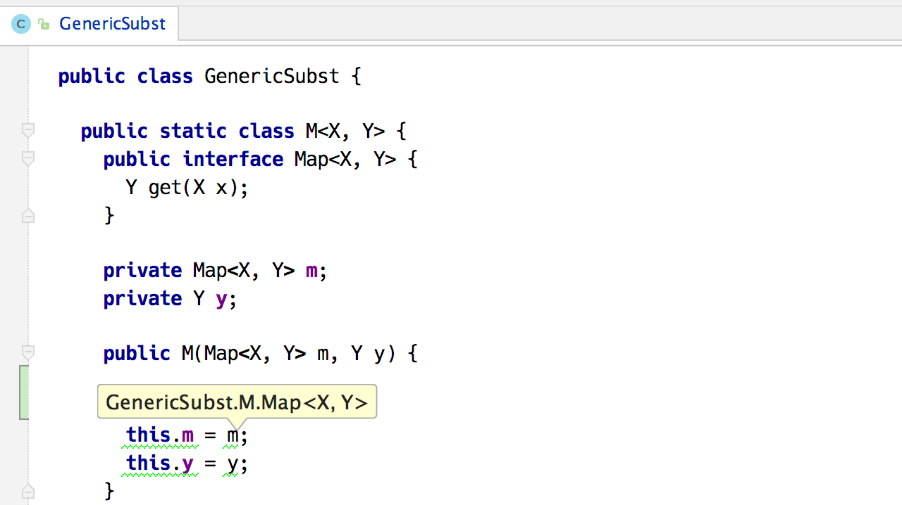

# Type Checking with Constraint Rules

An experimental feature for [JetBrains MPS](https://jetbrains.com/mps) implementing a better type checking and type inference using constraint rules.

## Status

[](https://travis-ci.org/fisakov/constraints-typechecking)

The status of this project is **pre-release**. Don’t rely on any of the language features or the API to be stable. The purpose of this project is to show the new technology and collect early feedback.

## Overview

This project is the result of the research done within the MPS team in the area of code analysis using constraint rules, in particular [CHR](http://www.informatik.uni-ulm.de/pm/fileadmin/pm/home/fruehwirth/constraint-handling-rules-book.html).

Typing rules serve as templates that produce constraint rules. Both transformation to constraint rules and evaluating is done in-memory at the time type checking is launched. Constraint rules are processed by the embedded [engine](https://github.com/fisakov/conreactor).

The source code also contains the typing rules for *baseLanguage*, which serve to demonstrate how the various type inference problems are solved.

## Features

The language *jetbrains.mps.typesystem2* enables to write typing rules. A custom aspect «types» is used to store the typing rules in the language source code.


Type checking plugin for MPS provides the actions for checking the types in a currently opened root.


Constraints activation trace view for debugging the process of evaluating constraint rules.


Once finished, the constraint rules produce the inferred types and type errors, which are added as highlighter annotations to the editor.



## Dependencies

The source code can be opened with the latest version of JetBrains MPS. The plugin that is created with the build script is also compatible with the same version of MPS.

## Installation

The easiest way to install the plugin is by using the update mechanism built in to JetBrains MPS. 

1. Open the Preferences dialog and select Plugins on the left
2. In the panel on the right select Browse Repositories…
3. In the dialog that appears select Manage Repositories…
4. Add a new repository with the following url:
```
https://raw.githubusercontent.com/fisakov/constraints-typechecking/updates/updatePlugins.xml
```
5. The list of plugins should be refreshed and the new plugin «typechecking» should appear
6. Install the plugin and restart the application.

Alternatively, the plugin can be installed manually. See the downloads section of the latest release for the plugin archive. This archive has to be unpacked to the MPS plugins folder on your local drive. For example (using macOS):

`unzip typechecker-0.2.zip -d ~/Library/Application\ Support/MPS2017.2/`

## Hacking

The project is built using [gradle](http://www.gradle.org). To work with the source code, follow these steps:

1. Install JetBrains MPS using [this link](https://jetbrains.com/mps/download).
2. Clone this repository to your local drive.
3. [optional] In the project folder put a *symlink* called «MPS_HOME» that leads to the MPS home folder:

    `ln -s /Applications/MPS\ 2017.1.app/Contents MPS_HOME`

    By doing so you skip unpacking the MPS distribution by the gradle script.

4. Run gradle using the following command to generate all models:

    `./gradlew generate`

    In order to execute full build, including artefacts, run this command:

    `./gradlew build`

    If you want to run the tests as well as building the project, execute this instead:

    `./gradlew test`

5. The project is now ready to be opened with MPS.

    NOTE: every time the source tree is cleaned, for example with `git clean` command, the gradle script has to be run in order to download the necessary libraries.

## License

Copyright 2014-2017 JetBrains s.r.o.

Licensed under the Apache License, Version 2.0 (the "License");
you may not use this file except in compliance with the License.
You may obtain a copy of the License at

http://www.apache.org/licenses/LICENSE-2.0

Unless required by applicable law or agreed to in writing, software
distributed under the License is distributed on an "AS IS" BASIS,
WITHOUT WARRANTIES OR CONDITIONS OF ANY KIND, either express or implied.
See the License for the specific language governing permissions and
limitations under the License.
