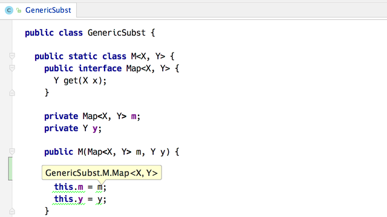
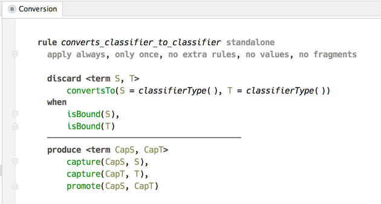
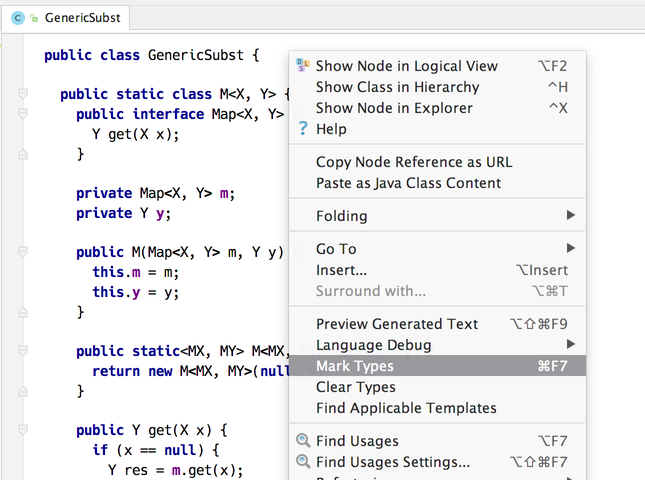

# Code Rules - Implementation Notes

## Structure

The project modules are separated into several groups to separate levels of abstraction.

#### Logic 

Define fundamental ideas used throughout the implementation, such as «data form» (a.k.a. term), logical variables, and others.

#### Code rules

Modules in this group define the core concepts of *coderules* and the logic behind it. This includes constraints, predicates, handlers, as well as code rule templates.

Constraints activation trace view for debugging the process of evaluating constraint rules.

Once finished, constraint rules produce inferred types and type errors, which are added as highlighter annotations to the editor.

#### Type checking

Defines a custom aspect «types», which is used to store the typing rules in the language source code.

Type checking plugin for MPS provides the actions for checking the types in a currently opened root.

#### Control flow

Declares only control flow aspect. All functionality is inherited from *coderules* language.
