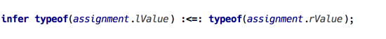
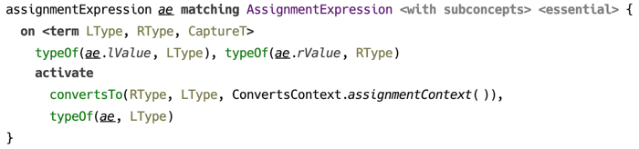
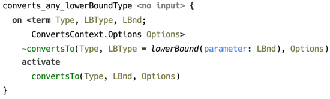

                                          
## MPS CodeRules

Type inference and type checking is a problematic area for language authors  — users of [JetBrains MPS](https://jetbrains.com/mps), because of inherent intricacies of the problem itself and sometimes less than adequate support from the framework.

*CodeRules* is a new technology that brings logic programming in the form of constraints processing as a vehicle for implementing type inference.

Type system in MPS is traditionally defined with help of type checking rules, in particular inference rules, which allow for making logical statements about types, such as “*is a*” or “*is a subtype of*”, enabling the internal engine to infer the specific type, deriving it from a collection of such statements, which are referred to as type equations and inequalities.

  
_(statement in `j.m.lang.typesystem` language)_

Albeit brief and concise, this notation leaves many questions unanswered when it comes to how exactly the system of equations and inequalities is processed. In other words, type inference is — for the most part — left up to the internal engine to decide. 

This limits the options for the author of type system to control how exactly subtyping is defined, and what happens with type parameters when computing sub- or supertype. Java, for instance, has several kinds of “conversions” with clearly defined rules controlling how types are transformed and what types are compatible in certain situations. All of this has to be emulated with “strong” and “weak” subtyping in MPS.  

Consider how type of a method call is calculated: details aside, in essence *when_concrete* has to be applied to types of each argument. Then we should either turn to inequalities and rely on the inference engine, or analyse the type structure and run closing computation when the *last* unknown type is finalised.

  
_(example of processing method arguments)_

Code rules may have a solution to these and other issues. The core idea is to employ a **constraints processing system** to process facts and relations, collectively known as constraints, with the user being in full control of what constraint rules to generate for given source model. With **logical variables** representing unknowns, and with support for **pattern matching** making use of term algebra and unification, it should be straightforward to define the core of type inference or a similar framework without having to rely on opaque implementation and pre-defined relations.

To illustrate the idea, let’s look at a couple of examples. These are taken from the type system implementation for BaseLanguage.

Type checking assignment expression could look like the following. What the code says is basically: once left and right sides of the assignment have types (not necessarily ground types), test if left side’s type converts to right side’s. Constraint `convertsTo/2` is defined in the same aspect, and the typesystem author has full control how it deals with type parameters, for example.

  
_(type checking assignment with constraint rules)_

Instead of waiting until a type has been finalised in order to access its structure, *pattern matching* is used to trigger constraint rules only on types of certain form. The example below shows how `convertsTo/2` is resolved for an instance of `LowerBoundType`.

  
_(resolution of `convertsTo/2` constraint using pattern matching)_

### Features 

 - A language for constructing rule templates that are applied to source model and may include constraint rules. The rules may be concept-specific or standalone.

 - *Constraint Processing System* — an extension of CHR[^chr] semantics allowing the use of unification in a constraint rule’s head with automatic binding of logical variables on successful match. This extension also supports alternative body branches, as well as calling arbitrary Java code. 

 - A framework for executing a constraint rules program, with support for error reporting from rules’s body. The UI also includes a tracing tool for providing insights into how constraints are processed.

Examples are provided that demonstrate the use of this technology for type checking.

    
### Table of contents

This documentation site is organized as follows:          

- [CodeRules Language](language) discusses the language features
- [Evaluating CodeRules Program](evaluating) explains the internals of CodeRules
- Examples include the following:
  - [Typechecking BaseLanguage](example-typechecking)
  - [Typechecking lambda calculus with extensions](example-lambdacalc-ext)
  - [Formal logic — Fitch proofs](example-logic)

- All documentation on [single page](allpages)

### Contacts

The project is hosted on [GitHub](https://github.com/jetbrains/mps-coderules), latest builds can be found [here](https://teamcity.jetbrains.com/viewType.html?buildTypeId=MPS_20211_Distribution_MpsCodeRules).

The author can be reached by email `fedor.isakov`@`jetbrains.com` or on [Twitter](https://twitter.com/fisakov).

[JetBrains MPS](https://www.jetbrains.com/mps/) is a project developed by [JetBrains](http://www.jetbrains.com/?fromFooter) and is available via [web](https://www.jetbrains.com/mps/) and [Twitter](http://twitter.com/jetbrains_mps)

#### Copyright

All contents is copyright © JetBrains 2021. All rights reserved.

[^chr]: Constraint Handling Rules [http://www.informatik.uni-ulm.de/pm/fileadmin/pm/home/fruehwirth/constraint-handling-rules-book.html](http://www.informatik.uni-ulm.de/pm/fileadmin/pm/home/fruehwirth/constraint-handling-rules-book.html)
