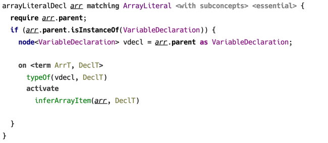
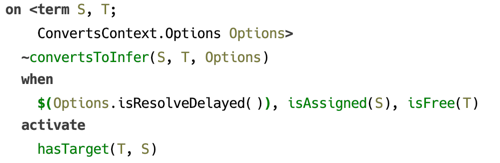
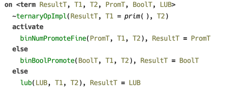
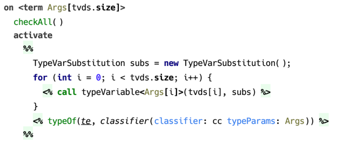
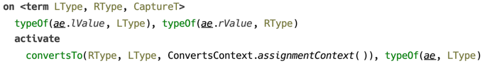
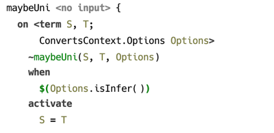

### Constraint Rules

At the core of CodeRules program lies the concept of *constraint rules*, which captures the essence of logical programming. The structure of a constraint rule enables to express a program as a list of logical clauses, each consisting of the *head* — the list of antecedents, and the *body* — the list of consequences. Both the *head* and the *body* are represented as lists of *constraints* and *predicates*. More on the semantics of *constraint rules* can be found in the section on [constraints processing](processing).

  
_(example of a constraint rule in a rule template)_

A *constraint rule* can be created at any place within a rule template’s body with the help of a keyword `on`. A constraint rule within a loop generates a runtime constraint rule on every iteration of this loop. 

A constraint rule must include either a body or a head, no constraint rule can omit both. 

##### Head

Constraints in a constraint rule’s head can be declared as either *kept* or *replaced*. Replaced constraints are marked with a tilde `~`.

There is a certain limitation as to what *constraints* can be used in rule’s head: it can only contain constraints defined by this rule table, or one of the rule tables it extends.[^headlimit] 

A constraint rule with an empty head, not declaring any constraints to serve as its input, is considered an *automatic* rule and is triggered automatically on start of constraint rules program execution.

##### Guard

The *guard* is optional and may contain only predicates or the `$()` expression which evaluates boolean-typed Java expression.

Predicates, also known otherwise as “built-in constraints” are represented either as binary operators, such as `=` for unification or `==` for equality, or they are boolean-valued functions. Unification or equality if used in guard, only tests that its arguments can be unified, otherwise if called from body, it invokes the actual unification or assigns the value to a logical variable.

There are also predicates that can only be queried, such as `isFree/1` or `isAssigned/1`, testing if a logical variable is free or has value assigned. Such predicates can only be used in guard. 

  
_(example of predicates used in guard)_

##### Body

Constraint rule’s body can contain any visible constraints declared by rule tables located in imported models, as well as *predicates*. 

  
_(`unifies` predicate used in the guard and in the body)_

A body may contain two or more *alternative branches*, which essentialy capture the idea of evaluating constraint rules with backtracking. Namely, the evaluation starts with the first branch, and in case it is finished without failures, other branches are not evaluated. On failure the second branch is evaluated, etc.

  
_(example of a constraint rule with alternative branches)_

A body may be created with the help of a *template fragment* — a block of code that produces constraints and macro calls via special *emit* statements: `<%…%>`.

  
_(example of constraint rule with a body template)_

#### Logical variables

A constraint rule can declare *logical variables*. By default a logical variable ranges over *terms*, although any Java object may serve as a value. A logical variable is used whenever a term or a term feature needs to be represented in a logical clause.

  
_(constraint rule declaring logical variables)_

When a constraint with logical variable as one of its arguments is matched, that variable becomes bound to the corresponding argument of the matching occurrence. The scope of such binding is this constraint rule’s guard and the body.

To illustrate how automatic binding of logical variables work, consider the following example. Constraint `typeOf/2` associates a type with a location in source model, and constraint `convertsTo/2` ensures its 1st argument can be converted to the 2nd, which must both be terms.

  
_(example of binding the logical variables)_

This constraint rule is triggered when both locations referred to as `ae.lValue` and `ae.rValue` have their types assigned, as both `typeOf/2` constraints must be present for a match to be successful. Once a constraint rule’s head is matched, both logical variables `LType` and `RType` become bound to whatever was the 2nd argument of corresponding `typeOf/2` constraint.

It’s important to note, that although on successful match both `lValue` and `rValue` have types, it’s not guaranteed that these types are *ground*. A type may be represented by a free logical variable, or a term containing free variables. 

Another very important thing to notice is that a logical variable enjoys full privileges of being an argument to a constraint. Which means, if in the above example both variables are free, and `LType = RType`, then both locations will have essentially the *same* type (in the sense of “same instance”), not just matching types.
  
#### Pattern matching

There is support for pattern matching, using terms as patterns, which may optionally contain logical variables. For this to work, a logical variable that serves as a constraint argument should have a pattern attached.  

The following example illustrates the use of *pattern matching* in a constraint rule’s head. Here, the first argument to constraint `convertsTo/2` in the head is a logical variable with pattern expression. In this case the constraint rule will only be triggered if the active constraint’s first argument is *bound* (is not a free logical variable), and it matches the pattern.

  
_(constraint rule with pattern matching)_

#### Evaluation of Java expressions

Arbitrary Java code can be called with `$()` predicate. It accepts either an expression of `boolean` type, in which case it can be used in guard, or expression of any type when called from body. In the latter case, the value expression evaluates is ignored.

  
_(example of using `$()` predicate)_

#### Using macros

In order to make use of macro definitions, which are essentially parameterised templates extracted to a separate root, one of the two pseudo predicates can be used: `expand` and `call`. The former accepts a node, whereas the second expects the arguments that are substituted as macro parameters.

[^headlimit]: This limitation has its origin in the way constraint rules are chosen when an active constraint is being processed. Namely, constraint rules to match an active constraint are selected from the rule table declaring this constraint, and rule tables that are its extensions. The order of constraint rules within the rule table matters, the ones declared on top are matched first. Productions from extending rule tables are prepended to the list of constraint rules of the rule table they extend.
