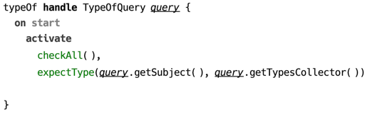
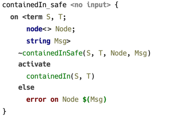
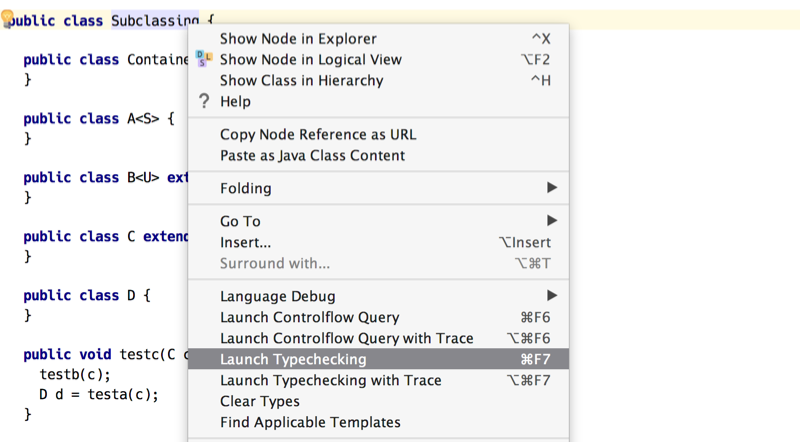
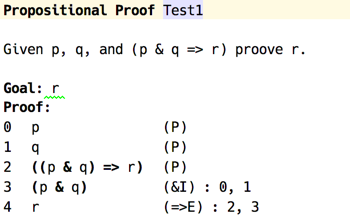
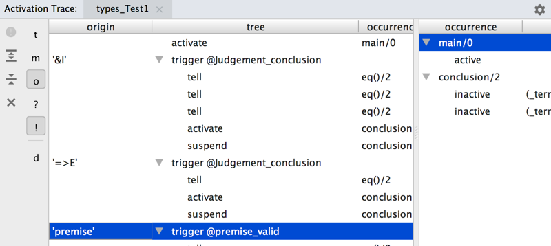

## Evaluating CodeRules

Analysis of source model with CodeRules can be described as a two-phase process.

1. Collecting rule tables and applying rule templates.
2. Processing constraint rules collected in the first stage.

In the first phase, languages used by the model being analysed and surveyed for the appropriate CodeRules aspect model, which is `types` in case of type checking.

The outcome of this phase is a *constraint rules program*, which is a collection of *rule tables*, which in turn represent lists of *constraint rules*. This “program” however, exists in memory only as it does not have any textual representation.

In the second phase the constraints program that was created in phase one is evaluated. Evaluation starts with a query, which serves as an entry point to the program. 

Queries correspond to usual procedures that analyse the source mode, such as `typeOf` or `convertsTo`, and are declared in the same aspect model.

  
_(example of a query)_

#### Applying rule templates

The first stage of evaluating CodeRules program begins with collecting rule tables. Rule tables are collected from corresponding aspects of all languages imported into the model. In addition to that, all extended languages are also included into the scope.

All rule tables collected in the previous step are sorted, so that the ones coming from extensions appear earlier. This sorting order ensures that when constraint rules are selected to match an active constraint, the constraint rules coming from extensions will have higher priority.

After the relevant rule tables are collected, the source model is traversed from the specified location, and the applicable rules are evaluated. As rule templates are applied, they produce constraint rules. As well as generating constraint rules, the rule templates are allowed to report messages to be displayed at source locations.

Generated constraint rules constitute the constraints program, which is then executed in the next stage.

#### Executing constraints program

In the second stage the constraints program is executed.

To begin execution, a *query* is selected, which contains the list of constraints to be activated. Query can be viewed as a regular constraint rule, which is triggered unconditionally.

There is a fixed order in which constraint rules are fired on start of program execution. First, all “on start” constraint rules are triggered. All constraints activated by these constraint rules are processed normally, and after there are no more constraint rules to be triggered, the query is fired.

Order of constraint rules fired:

1. “on start” rules
2. query

While constraints program is run, it is allowed to report feedback, such as assign calculated types or report problems, using special constructs, that are available as predicates in the body of a constraint rule.

Failures may be encountered during constraints program execution, such as a unification failure, and they are caught with the help of alternative body branches, when those are provided. An uncaught failure terminates program execution and is reported to the user.

In the following example, a potential error is caught in the `else` branch and a corresponding errors is reported. Execution of constraints program is not terminated though, so other problems may still be reported.

  
_(example of using an alternative body branch)_

### User interface

The user interface is defined by a plugin responsible for particular language aspect.

  
_(context menu with type checking actions)_

### Activation trace view

During execution of a constraints program all activation/suspension/deactivation events, as well as ask/tell queries to predicates can be displayed in a dedicated view.

  
_(sample proof in propositional logic)_

Above is an example of a proof in propositional logic, the trace of checking which is provided below. The rows in the left pane correspond to events happening during constraints processing, such a constraint activated or suspended, or a constraint rule triggered. When a row in the left pane side selected, the right pane displays the contents of *constraints store* captured at the moment the event occurred.

  
_(activation trace view)_
