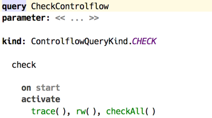
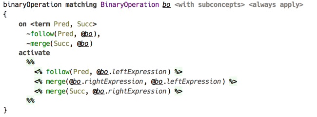
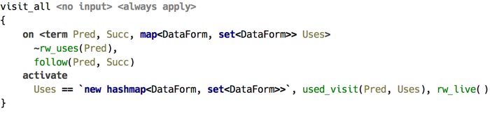
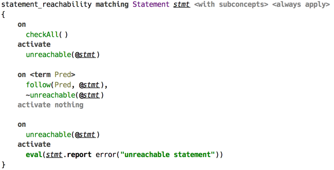
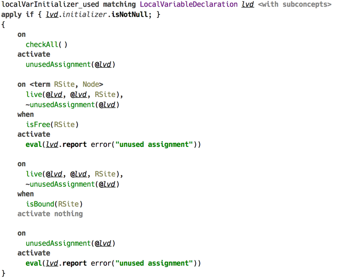

# Control Flow Analysis

This sample demonstrates how *code rules* can be used for building a complicated analysis, which otherwise requires creating a DSL and runtime library to implement the logic of analysis. The control flow analysis presented here is far from being complete, and serves demo purposes only.  

Language `jetbrains.mps.lang.controlflow` declares an aspect for storing control flow rules. An aspect model `controlflow` in language `jetbrains.mps.baseLanguage.ext` contains the implementation of control flow analysis.

  
_(controlflow aspect declaration)_

Control flow analysis starts with activating constraint `trace/0`. This initiates building of a flow graph, which starts at the first statement of a method’s body. 

  
_(controlflow query)_

Constraint `follow/2` binds together two locations that are adjacent in the control flow graph, and `merge/2` is an auxiliary helper, which is used to mark the «exit point» for a search that goes *depth-first* into subexpressions. 

  
_(control flow check of binary operation)_

The meaning of `follow(@A, @B)` is «B follows A», and `merge(@X, @Y)` — «X should follow whatever location is last after traversing Y». 

Read and write locations are processed once the control flow graph has been built. This is when `rw/0` constraint activates and starts this phase of the analysis. This phase also consists of two parts, and these are repeated for every method declaration. This is done by putting two constraints in a conjunction, as shown below. 

  
_(initiating collection of «uses» map, then activating «live» analysis)_

First, the control flow graph is walked from starting location, which can be a method declaration, for example. During the traversal of the graph a mapping of «uses» is collected — a map where keys are locations that are read, and values are sets of locations where reading happens. Uninitialised reads are detected at this stage. 

Second, all *write* locations are visited again, this time ensuring there is at least one read after a write. 

Finally, the reachability and variable read/write conditions are analysed and the errors are reported in `Check` handler. 

  
_(reachability detection)_

  
_(local variable read analysis)_

