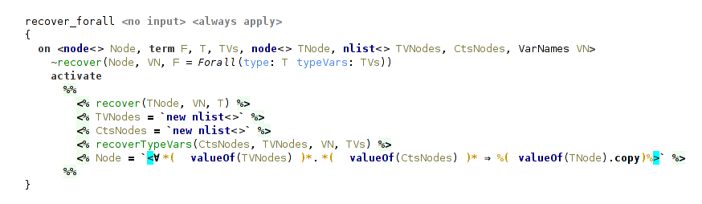

## Typechecking Extended STLC

Simply Typed Lambda Calculus (STLC) is a famous example favored by textbook authors.
This sample demonstrates how a classical type checking algorithm (Hindley-Milner[^hm]) designed for this language can be implemented using Code Rules.
It also presents two substantial extensions to basic Hindley-Milner type inference: type annotations and typeclasses from Haskell.
They will be discussed in succession, highlighting some of the useful features of Code Rules language and implementation challenges that type system itself introduces.
These extensions show that even an advanced type system can be implemented using Code Rules, and in a natural way rule-based way.

For purposes of keeping this sample a bit simpler, we keep the language confined to boolean values. Aside of boolean constants `True` and `False`, the mandatory lambda abstraction and application, `let-in` expression, and `if-then-else`, we have in addition defined pairs of values and `fix` operator to support recursion.

The syntax of presented lambda calculus is compatible with Haskell, and consequently all examples can be typechecked with, for example, GHC (Glasgow Haskell Compiler).
The required extensions for GHC are:
- for basic STLC: `UnicodeSyntax` and `ExplicitForAll`;
- for STLC with type annotations: additionally, `ScopedTypeVariables` and `RankNTypes`;
- for STLC with typeclasses: additionally, `FlexibleInstances`.
<!-- -- `OverlappingInstances` (optional) -->

<!-- ~some disclaimer: why typing rules may be different from more traditional type formulations, see below -->

The dataform table is trivial, there're two terms used in Cons-list implementation (`Cons` and `Nil`), term `Constraint` used in the part of type system concerned with typeclasses, and other expected terms for types (`Fun` for function type, `Forall` for universal types etc.).

  
_(dataform table)_

There is only one query of kind `TYPECHECK`, which launches types recovery. All the type checking is done by the automatic productions “on start”.

### Basic Hindley-Milner Type Inference

The basic type inference is covered by the several handlers: handler `typeOf` that contains most of the typing rules, handler `forall` covers typing of universal types, `recover` handler is concerned with translating inferred types back to SNodes representation, and `consList` is an utility handler.

<!-- TODO -->
<!-- EXAMPLES OF CONSTRUCTS & TYPE OUTPUT -->
<!--  -->
<!--  -->
<!--  -->
<!--  -->
<!--  -->

#### Cons-list

Handler `consList` is a straightforward implementation of Cons-list, present in all functional programming languages. Implementation consists of `Cons` and `Nil` data forms, `append` constraint and two rules that process it, one for common case and one for base case (when one of the input lists is empty).
There's also a helper function, that translates lists embedded in Code Rules to these ad-hoc Cons-lists.

  
_(single rule implementing cons-list)_

#### Main Typechecking Rules

Handler `typeOf` contains most of the type inference rules.
Besides `typeOf` constraint it also declares a helper constraint `newTypeVars`.
Its role is simple, it collects newly introduced type variables.
It is needed for later generalization on let-bindings.
Type variables are introduced at lambda-bindings and at instantiations of universal types.
Fresh type variables are represented simply by fresh logical variables.
For example, this is a rule for lambda-bindings:
<!-- A variable introduced by lambda abstraction is assigned a type, which is a fresh logical variable. -->

  
_(typing rule for a lambda-binding)_

It's important to note that these variables can later be bound to something during the process of type inference, and so just before generalization on `let` we need to additionally check that the variables are indeed free.

Actually, the process of collecting free type variables could be implemented on the language level with a something like a predicate `term_variables/2` from Prolog, instead of manual tracking using `newTypeVars` constraint.

Typing rules for the most of the nodes are straightforward: rules match on `typeOf` and `newTypeVars` constraints of the node's children and produce these in their turn.
There're additional conditions on some of the rules, because their handling depends on whether these nodes are annotated or not. The case with annotations is processed in another handler `annotation`.
For example, in the case of unannotated let-binding we simply generalize over all free variables in the bound expression:

  
_(typing rule for a let-binding)_

In the typing rule for variable occurrences they are instantiated with a help of `inst` constraint.
It also returns a list of fresh instantiated variables.
This rule ensures that terms with universal types can actually be used polymorphically.

  
_(typing rule for a variable reference)_

The type checking for `if-then-else` ensures that the types of both branches unify, and assigns the resulting unified type to the whole expression.

  
_(typing rule for conditional expression)_

The most interesting rule here is for function application. Besides instantiating function, which may has polymorphic type, it also checks that the function can be applied to the argument, according to the types.
<!-- TODO about else branch -->

The subsumption relation on types, that checks this, comes from the need to account for type annotations and is covered later. In short, it handles the case when the actual argument has a more general (more polymorphic) type, than type of the formal parameter. In other words, when the parameter's type is _subsumed_ by the argument's type.
In the basic STLC formulation we would have here a usual unification between parameter's type and actual argument's type.

  
_(typing rule for function application)_

Finally, the `fix` operator, which represents general recursion, is given the type `∀a. (a → a) → a`.
<!-- `forall a. (a -> a) -> a`. -->

  
_(typing rule for `fix` operator)_

#### Typechecking Universal Types

A separate handler is dedicated to producing and instantiating universal types, and it is the most interesting part of STLC.
The handler declares two general constraints `gen` and `inst` together with several helper constraints.

##### Generalization

`gen` constraint returns universal type through the logical variable passed as the first argument, accepts the type to generalize in the second argument and the type variables to generalize over (collected with `newTypeVars` constraint) in the third.
`gen` activates 2 helper constraints: the first processes type vars one by one (that's where the main work happens), and the second handles several different cases depending on the form of type that is generalized.

  
_(rule for a type generalization)_

Generalization of a single free type variable consists from two steps.
The first step is concerned with typeclass constraints on type variables, and will be explained in the corresponding section below.
In short, we need to get the type constraints, that the type variable collected during type inference, and fix them, because they become a part of the definition of type variable in its type scheme and mustn't change.
The second step is a substitution of its occurrences in the generalized type with references to a fresh type variable playing a role of its definition.
This is accomplished simply by a unification of free type var with `VarRef` data form, pointing to this fresh type var.

  
_(generalization of a single type variable)_

The fresh type variables are collected and then passed to the second helper constraint, that actually produces universal type.
It may appear, that in the type there're no free type variables to generalize over. In this case we shouldn't produce universal type.

  
_(not generalizing with no free type variables)_

In another case, when the generalized type is itself a universal type we merge the sets of the generalized type variables to avoid nested universal types.

  
_(generalization of a universal type)_

And in the common case we just produce a universal type with processed type variables.

  
_(generalization, common case)_

For example, generalizing a type `Fun(arg: A res: B)`, where `A` and `B` are free terms (type variables) we will get `Forall(type: Fun(arg: VarRef(def: C) res: VarRef(def: D)) typeVars: [C, D])`, where `C` and `D` are fresh variables.

##### Instantiation

Instantiation of a universal type mirrors generalization of a type.
`inst` constraint also depends on the form of a type being instantiated.
There're two cases: the trivial case, when the instantiated type is not a universal type, and the common case, when the instantiated type is really a universal type.

In the former case we essentially do nothing, and return the same type and an empty list of instantiated type variables.

  
_(instantiating non-universal type)_

The latter case uses a helper constraint, that processes bound type variables from universal type one by one.

  
_(instantiating universal type)_

Instantiation of a single bound type variable has two steps.
The first step is a substitution of all references to bound type variable with a fresh term.
It is done with a call to `subst`, a part of the internal API.
The second step is concerned with typeclass constraints. What we need to do here is to instantiate (copy, really) the set of typeclass constraints for the freshly instantiated type variable.
This variable is collected to the list of instantiated type variables for the caller.

  
_(instantiating single type variable)_

#### Outputting Types

The handler `recover` is responsible for translating the calculated types to SNode form and is pretty straightforward. On each typeable node a `recover` constraint is activated. SNodes representing types are constructed using quotations.

  
_(starting type recovery)_

The rules for type variables ensure that every one of them has an assigned name.
For variables without names assigned in type annotations the second rule will assign them with a help of `VarNames` utility.

  
_(recover type variable)_
    <!-- SHOW BOTH RULES -->

The most involved rule is for universal type, because it requires to recover and collect in a list SNodes representing type variables.
Analogously, for each type variable we need to recover and collect its typeclass constraints.

  
_(recover universal type)_

  
_(recover bound type variable from universal type)_
    <!-- SHOW FORALL RULES FOR FORALL & RECOVERTYPEVARS -->

Next, we turn our attention to the extensions to STLC.

### Type Annotations

Extension of STLC with type annotations demonstrates two important points: a usage of Code Rules macros and an implementation of a relation between types in the form of constraint. Relations on types are present in many type systems, and probably the most widespread example is a subtyping relation (e.g. `isSubtype(type1, type2)`). As a matter of fact, the `subsumed` relation, presented here, is a form of subtyping too, as explained below.

#### Macros

Code Rules macros can help to keep the formulation of a type system cleaner, by moving out to a macro table some routine tasks, such as creating complex terms or building dataform representations of SNodes.
For such cases macros can be viewed as a form of constructors, when creation of a dataform requires, for example, recursive creation of subterms or production of constraints.

In this lambda calculus there's a single macro table called `types` for translation of SNodes, representing type annotations, to corresponding dataforms for manipulation in Code Rules program.

A typical example of a macro is for the function type. It recursively invokes macros for its argument and result types.

  
_(macro for a function type)_

Macro for a type variable produces a fresh logical variable each time it is invoked.

  
_(macro for a type variable)_

As it can be invoked several times, we need to unify different logical variables emitted for a single type variable.
It is done in handler `annotation`.
We also emit a special constraint to carry type variable's name.
It's needed for outputting types in handler `recover` with expected names.

  
_(unifying duplicate logical variables)_

#### Typing Rules for Annotations

All these macros are used in the handler `annotation` in a rule that produces a single constraint carrying the type from annotation:

  
_(usage of a macro expansion)_
<!-- _usage macro expansion for translating type SNode_ -->

Handler `annotation` defines several important rules.
Two of them are concerned with special handling of annotated bindings (let-binding and lambda-binding).
For lambda-binding we simply propagate the type from annotation, because at this point, at the introduction of a new variable, there're no constraints on it to check against.

  
_(annotated lambda-binding just assigns to its variable type from the annotation)_

The case of let-binding is different. Here we need to check the annotation against the inferred type of the bound expression. This is done with a help of `subsumed` constraint, explained below. It is the only difference of this typing rule from a rule for unannotated let-binding.

  
_(annotated let-binding checks annotation against inferred type with `subsumed`)_

Another rule is concerned with annotated expressions.
In this case we check against the type of inferred expression, analogously to the rule for let-binding.

  
_(annotated expression also includes `subsumed` check)_

In essence, this is all that is special about type annotations.
Most of the work and complexity is about `subsumed` relation to make the type system more expressive: it is concerned with higher-rank types.
We can substitute all occurrences of `subsumed` constraint for the unification predicate and get a usual STLC with simple type annotations, that must be equivalent to inferred types everywhere.

The following discussion is mostly concerned with a description of aspects of the type system and less so with Code Rules.

#### Higher-Rank Polymorphism

Type annotations provide us with a better understanding of the code.
For example, in Haskell it is considered a good practice to write type annotations for all top-level definitions.
But code documentation is not the only application of type annotations.

Hindley-Milner type inference is a very powerful type system and allows to write very generic programs without type annotations at all.
But that conciseness comes at a price. This type system doesn't cover all terms that a programmer <!-- (even a sane programmer) --> would like to write.
For example, this construct is not typeable within Hindley-Milner type system: `let f = (\g → (g True, g 42)) in f (\x → x)`, but `f` here could have a type `(∀a.a → a) → (Bool, Int)`.
You can also imagine a case, where you want to operate on heterogeneous lists with a polymorphic function: `f (g :: (∀c. [c] → Int) = g ["hello"] + g [1,2]`. Here `f` has a type `f :: (∀c. [c] → Int) → Int`.
And this is a perfectly sane case for functional programming!

There comes a notion of higher-rank polymorphism.
Hindley-Milner type system can only infer rank-1 types.
Rank-1 types have only a single outer-most universal quantifier.
For example, a familiar function `map` has a type `map :: ∀a b. (a → b) → [a] → [b]`.
If a type contains quantifiers only to the right sides of arrows, it is a rank-1 type too.
It's because inner quantifiers can be "floated out" to the outer level without a loss of generality.
So, such types are essentially equivalent to the types with a single outer-most quantifier.
For example, compare these types: `∀a b. a → b → a` and `∀a. a → (∀b. b → a)`.
They behave in the same way in all possible uses.

Things become more interesting when we want to accept polymorphic types as arguments to functions.
Notice that these two types for a function `f` from a previous example mean something completely different:
`f :: (∀c. [c] → Int) → Int` and `f :: ∀c. ([c] → Int) → Int`.
With a second type `f` just wouldn't typecheck.
That's why we can't "float out" quantifiers that appear as arguments to functions.
Such types are called higher-ranked types.
Formally, the rank of a type is how deep universal quantifiers are nested to the left side of arrows, that is, a number of these arrows.
For example, these are rank-2 types: `(∀a. a → a) → Bool` and `(Bool → (∀a. a → a)) → Bool`, while that is a rank-3 type: `((∀a. a → a) → Bool) → Bool`.

Higher-ranked types can't be inferred without a help from the programmer in the form of type annotations.
Programmer can provide type annotations in the cases where he needs something more expressive.
Actually, rank-2 types are sufficient for most of the use cases, but the machinery required for typing them contains all of the features needed for typing arbitrary higher-ranked types.
This case, where programmer can make some types more general then they would be inferred, requires a noticeably more involved type system.
Theoretical treatment of type systems handling type annotations on top of Hindley-Milner type inference can be found in several papers, with a closest one to the current implementation in [^spjones2007] (and this paper, probably, is more accessible).

For the implementation it means that we need to check that the type annotation provided for a term agrees with all its usages.
Specifically, that the term (i.e. its type) can be instantiated to the type, required by its usage.

#### Subsumption Relation

Handler `subsumption` defines one main constraint `subsumed` that follows a `dsk` relation from the corresponding paper[^spjones2007].
`subsumed` implements a form of subtyping between polymorphic types, where less general type is a subtype of a more general (more polymorphic) type.
It means that if type `A` can be instantiated to type `B`, then type `A` is more general than type `B`.
This relation `subsumed(B, A)` can be read as: _“type B is subsumed by type A”_  that means _“type B is less polymorphic than type A”_.
A minor note is that directions of `subsumed` and `dsk` relations are opposite, so where `dsk(A, B)` holds, there `subsumed(B, A)` holds.

Although `dsk` and `subsumed` behave in the same way, there're some important differences between theoretical treatment of this relation and its implementation in Code Rules.
Formal definition of a `dsk` needs to take into account some details, which in the case of `subsumed` are handled by Code Rules.
For example, tracking variable names to avoid invalid cyclic substitutions (that is, to perform _occurs check_), that in Code Rules is done during unification.  <!-- **TODO** something else? -->
So Code Rules can actually reduce the burden lying on a developer implementing a type system and trying to closely follow its theoretical treatment.

Subsumption proceeds by pattern matching on types in question.
As we computing a relation between polymorphic (i.e. universal) types, the most important rules are concerned, of course, with universal quantifiers.
There're two cases for this, depending on which side of relation the universal type is.
Before the check the universal types are instantiated (i.e. type variables in them are substituted for fresh logical variables).
Then we proceed with recursive subsumption check on these instantiated types.
The most important part comes after that: we need to check that the types, to which type variables are instantiated, are valid and consistent.
The required checks differ for these two rules. That's where the asymmetric nature of relation manifests itself.
For details, the reader can proceed to an example for polymorphic pair types described below or, for a full treatment, to the original paper.[^spjones2007]

  
_(subsumption rules for universal types)_

Another important case is that of leaves, when one of the types is either a type variable reference or a free type variable (either instantiated or initially free, that is, not bound during the process of type inference).
In the case of free type variable we unify it with another term, essentially instantiating type variable to it.
If there will be _conflicting instantiations of the same type variable to different types_, unification will fail and halt typechecking.

  
_(leaves in subsumption are unified)_

But if the second term is a free type variable too, then unification will succeed and we may need to perform additional check.
For example, consider checking subsumption relation for this case: `∀a b.(a,b) ≤ ∀c.(c,c)`.
As you can see, subsumption relation doesn't hold here, because the second type is not more general than the first.
In the subsumption rules for universal types all bound type variables will be instantiated, and we will need to check `subsumed(Pair(A,B), Pair(C,C))`, where `A`, `B` and `C` are free (instantiated) type variables.
Rule for leaves will successfully unify `A` with `C` and then also `B` with `C`, and we will get `A=B=C`.
But this is certainly not what we want!
That's why, besides unification in the rule for leaves, we need an additional check ensuring that there're _no conflicting instantiation of one type variable to several different type variables_.
This check is relevant only for free type variables coming from the instantiation of universal types.
So it is performed only in the rules for universal types.

In the case of variable references (that is, type variables bound by some universal quantifier) they must match because these variables are _rigid_, and they can't be unified. This case is essentially the same as in Haskell, where, for example, two type variables with different names entered by a user can't be unified.

  
_(rigid type variables in subsumption are checked for equality)_
    <!-- TODO example from haskell? from here? -->

Subsumption rule for function types proceeds by checking argument and result types.
It is analogous to typical subtyping rules for function types: argument types are checked contravariantly, result types are checked covariantly.

  
_(subsumption rule for function type)_

Rule for a pair type is straightforward.

  
_(subsumption rule for pair type)_

That's how implementation of a complex relation on types can look like in Code Rules.

### Typeclasses

Haskell typeclasses are one of the most important and complex features of its type system, that distinguishes Haskell among other well-known functional languages.
Implementing typeclasees using Code Rules shows that it has expressive power that is sufficient even for the advanced type systems.
This implementation partly relies on the reference Haskell typechecker[^thih].

_Note about notions: by the word "constraints" are meant Code Rules constraints, whereas typeclass constraints are called in this qualified way ("typeclass constraints"), or with an uppercase letter ("Constraints") to avoid ambiguity._

#### Typeclass Constraints

In essence, typeclasses extend type system by adding a kind of requirements, Constraints on type variables that are bound by universal quantifier.
Type system needs to carefully track that universal types are instantiated only to the types satisfying their Constraints, and that the types are generalized to universal types properly, without leaving out any Constraints.

For example, we can instantiate a universal type `∀ a. (C1 a, C2 a) ⇒ (a, a) → a` only to a type that satisfies both Constraints `C1` and `C2`.
Or, in case of a generalization, given a function `mappend ∷ ∀ a. Monoid a ⇒ a → a → a`, for a function `f` in `let f = (\x → mappend x x)` we must infer a type `∀ t. Monoid t ⇒ t → t`.

Everything else is mostly a matter of other language aspects (structure, editor and constraints aspects) and not of a type system.
Still, it's important to note, that type system doesn't need to check that type variables are properly scoped, because it is handled by "constraints" language aspect.
It slightly simplifies the type system.
    <!-- MAYBE MOVE IN PREVIOUS SECTION ABOUT STLC? -->

So, existing type system needs to be modified only in the places concerned with universal types:
- modification of generalization & instantiation of type variables in `forall` handler;
- straightforward additions in macro table `types` and `recover` handler.

The major part of typechecking typeclasses is placed in several new handlers:
- handling declarations of typeclasses and its instances --- in `typeclasses` handler;
- processing typeclass constraints (collecting and checking them) --- in `typeConstraints` handler;
- implementation of the Set data structure, used mainly in `typeConstraints` handler --- in `set` handler.

Now, let's move through these handlers.

#### Set Data Structure

Handler `set` implements the Set data structure together with several utility functions.
A set is represented as a number of `set` constraints in the constraint store.
Each `set` constraint has 2 arguments: the first argument is a free logical variable representing handle for the data structure and the second argument is an element belonging to it.
As an example, a set `{a, b, d}` (where a, b and d are some dataforms or free logical variables) will be represented as three constraints: `set(S1, a)`, `set(S1, b)` and `set(S1, d)`, where `S1` is a Set handle.
Programmer can manipulate the set with a handle.
The implementation consists of a single rule that maintains the set invariant, i.e. that it can't contain two equal elements.
<!-- Notice that the `equals` predicate is used here. -->

  
_(set data structure implementation)_

The beauty of such representation of a set is that merging sets comes essentially for free and, moreover, is performed implicitly.
To merge two sets a programmer only needs to unify their handles.
And there one crucial feature of Code Rules enters the picture: constraint reactivation.
When arguments of inactive constraints in the constraint store change (for example, are unified with something), these constraints are reactivated.

Consider the following example.
Assume there're two sets `S1 = {a, b}` and `S2 = {a, c}` and the constraint store contains four constraints representing them: `set(S1, a)`, `set(S1, b)`, `set(S2, a)` and `set(S2, c)`.
Next, unification of logical variables `S1` and `S2` happens (`S1 = S2`).
Due to automatic reactivation, all inactive constraints in the store that refer to these unified variables will be activated again.
Because of this they will be tested for matching on the rule maintaining set invariant.
In this particular case it will be triggered on the constraints `set(S1, a)` and `set(S2, a)` (remember, here `S1=S2`) and discard one of them.
After this constraint store will contain only three `set` constraints (`set(S1, a)`, `set(S1, b)` and `set(S1, c)`), representing the result of merging `{a, b}` and `{a, c}`, a set `{a, b, c}`.
The implementation of a set is also an example of one useful Code Rules pattern: maintaining some invariant assumed by other rules using a top-level rule, that will be matched first and ensure invariant.

Handler `set` also declares several utility functions with straightforward implementations:
- copying a set;
- making a Cons-list out of a set while removing the original set;
- making a Cons-list out of a set while preserving the original set;
- testing whether one set is a subset of another.

  
_(copy a set)_

  
_(test whether one set is a subset of another)_

#### Representation of Typeclass Constraints

Typeclass constraints are used in 2 roles during type checking: in definitions of type variables bound by quantifiers and as requirements on types.
Handler `typeConstraints` declares 2 constraints that correspond to these 2 roles: `tdefConstraints` and `typeConstraints`.
They map a type variable to a set of its typeclass constraints.
Contrast it with how type variables are represented: they're explicitly stored in a list in the `Forall` dataform.
Thus, typeclass constraints on a type variable are stored implicitly, not inside the `Forall` dataform, but in the constraint store.
Their representation as a set greatly simplifies working with them.

During the process of type inference free logical variables representing yet unknown types can be unified.
Previously we haven't given much thought to it, unification just happened without our attention.
<!-- But what happens now, when they can carry sets of typeclass constraints? -->
But now consider this question: what changes when free type variables can carry sets of typeclass constraints?
The answer is that we should merge these sets when variables are unified.
But at which point? The problem is that unification can happen at any point (in any rule) during type inference.
And that's where constraint reactivation again helps us, now for `typeConstraints` and `tdefConstraints`.
The following rule is a top rule in handler `typeConstraints`.
It ensures, that each type variable has a single set of all its typeclass constraints.

.png)  
_(merging Constraints sets)_

It is clear how to collect typeclass constraints during the process of type inference.
But what we further need to do with this set of typeclass constraints depends on what happens to the type variable.
There're two cases: it either remains free until the point of generalization (i.e. let-binding) or it is bound to a type.

#### Checking Typeclass Constraints

When free type variable becomes bound to something, we need to check that all typeclass constraints collected up to this point are satisfied.
Due to constraint reactivation, another rule that starts this check will be triggered.

  
_(rule playing a role of entry point to typeclass constraints check)_

There're 2 cases: it can be bound to a ground type (e.g. function type, Bool) or a type variable reference.
The cases differ and require different checks.

  
_(check collected typeclass constraints for a type variable: 2 cases)_

##### Strength Check

First, let's consider a slightly less obvious case of a type variable reference.
It refers to a type variable bound by some universal quantifier, and so, as part of its definition, has its own set of typeclass constraints.
This set must be more restrictive than the set of collected typeclass constraints we need to satisfy.
In other words, the type variable can't be instantiated to a type (here, type variable reference) that doesn't satisfy its typeclass constraints.
To check it we need to ensure that for each Constraint from the set of collected ones there's a matching Constraint to satisfy it.
It can be done with a `isSubset` check.

  
_(strength check: checking the restrictiveness of two Constraint sets)_

For example, given a function application `f x` with types `x ∷ C1 t ⇒ t` (`t` is bound somewhere else) and `f ∷ ∀ a.(C1 a, C2 a) ⇒ a → a`, the strength check will clearly fail, because the Constraints set `{C1}` on the type variable `t` _is not more restrictive_ than the set `{C1, C2}`. The set `{C1, C2}` is not a subset of `{C1}`.

##### Instance Check

The second case of a usual type is more intuitive and more common, but its implementation is a bit more involved.
The first two rules in it do nothing special: the first makes a list out of the set and the second traverses it, triggering actual instance check for each typeclass constraint on a type.

.png)  
_(instance check, first two rules)_

The next two rules try to find a matching instance among all instances of the typeclass with a help of `instance` constraint.
It is present in the constraint store for each declared typeclass instance in a program.
Typeclass instances can be declared not only for types but also for type schemes.
For example, Haskell has the following instance of `Monoid` typeclass: `instance Monoid [a]` where the instance is declared for a universal type `forall a. [a]`. Compare it to `instance Monoid Bool` where we have a usual type `Bool`.
That's why we need to try instantiating the type scheme from instance declaration to the type in question.
It is done with a combination of `inst` constraint and unification.
It's important to note, that instantiation here may trigger recursive `instanceCheck`.

For example, consider how `instanceCheck(Pair(Bool, Bool), {Monoid})` proceeds in presence of `instance Monoid Bool` and `instance (Monoid a, Monoid b) => Monoid (a, b)` in a program.
Here we first need to find an instance for pairs, and then additionally check its own Constraints: that there exist instances for both element types of a pair. The type `(Bool, Bool)` satisfies this requirement given these 2 instances.

The last rule simply fails in case when no matching instance is found.
The typecheck is failed by triggering `eval(false)`.
Of course, it isn't the best mechanism for reporting type system errors, but it's a temporary solution.

<!--    -->
.png)  
_(instance check: searching for a typeclass instance for a type)_

#### Universal Types and Typeclass Constraints

Typeclasses require only a little change to `forall` handler.
In the rule for generalization of a type variable we have to add only a single production that moves collected typeclass constraints (in `typeConstraints`) to a definition (`tdefConstraints`).

  
_(generalization over a single type variable: notice activation of `produceTypeConstraints`)_
<!-- _(notice `produceTypeConstraints` production)_ -->

  
_(collected typeclass constraints become part of the type variable definition)_

The constraint `tdefConstraints` is used in an instantiation of a type variable.
We essentially do the opposite: we copy typeclass constraints from the definition (`tdefConstraints`) to a new set (in `typeConstraints`) for a freshly instantiated type variable.

  
_(instantiation of a single type variable: notice activation of `typeConstraints` with a copied set)_
<!-- _(notice activation of `typeConstraints` with a copied set)_ -->

#### Typeclass and Instance Declarations

Handler `typeclasses` extends `annotation` handler and declares no new constraints.
It ensures the well-formedness of typeclass and instance declarations, and defines typechecking dependencies using `require` statements.

The rule for typeclass declaration only processes declaration of type variable declared in a typeclass and produces an auxiliary constraint carrying typeclass name, used in `recover` handler.

  
_(processing typeclass declaration)_

The rule for instance declaration is also straightforward. It expands a macro for its type scheme and produces `instance` constraint that is used in `instanceCheck`.

  
_(processing instance declaration)_

Typeclass contains a number of function Prototype declarations (i.e. pairs of symbol and type).
The rule for them just produces their type given type annotation.

  
_(producing type of a Prototype in a typeclass)_

Instance, correspondingly, contains Prototype implementations, and they require the most involved rule.
It checks that the actual type of the implementation agrees with a Prototype's type.
The first step of this is to instantiate the generic Prototype to the Instance type scheme.
The second step is to actually check that the types agree, that is, the type of the implementation does not restrict the Prototype's type (in other words, it is more general). It is checked using subsumption relation.

  
_(checking correctness of Prototype implementations)_

That is everything there is to the typechecking of typeclasses.
To recap, the most important rules are concerned with processing typeclass constraints.
They're implemented in a way to be triggered automatically, while other rules heavily rely on this automatic and implicit checking of typeclass constraints.
<!-- So, these rules for processing declarations and universal types are simpler than they could have been. -->

<!-- TODO -->
<!--     `types` --- trivial -->
<!--     `recover` --- nothing special, has already been described. -->
<!--         but SHOW recovering Constraints? -->
<!-- .to mention -->
<!--     aux constraint for 'recover' to avoid unnecessary dependencies -->

<!-- ### Conclusion -->

[^hm]: See for example: Cardelli, Luca. "Basic polymorphic typechecking." Science of computer programming 8.2 (1987): 147-172.

<!-- [^odersky1996] -->

[^spjones2007]: [Practical type inference for arbitrary-rank types](https://www.microsoft.com/en-us/research/wp-content/uploads/2016/02/putting.pdf)

[^thih]: See [Mark P. Jones. "Typing Haskell in Haskell"](https://web.cecs.pdx.edu/~mpj/thih/thih.pdf).

<!--    -->
<!-- _()_ -->
