# Code Rules Language

### Language Aspect

Code rules are declared by handlers, which are root concepts of language `jetbrains.mps.lang.coderules`. Handlers and other roots should be created in a language’s aspect model corresponding to a specific kind of analysis. Language `jetbrains.mps.lang.typechecking` declares the aspect `types`. 

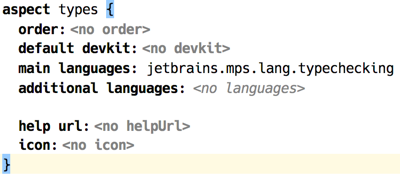  
_(definition of aspect `types`)_

#### Root concepts

The following table contains the root concepts that belong to code rules definition.

| Concept         | Description |
|:-- |:-- |
| *Handler*     | contains rules and constraint declarations |
| *Query*       | entry point to the constraints program |
| *MacroTable*  | defines how terms are constructed |
| *DataFormTable* [^dft]  | defines terms, the data structure that is used in unification |

### Handler

*Handler* serves two purposes: it declares the constraints that can be used in the *head* of productions in this handler and its extensions, and it  also declares *rules*, which are, simply put, procedures applicable to specific concept and (optionally) its subconcepts.

#### Rules

The aim of rules defined by handlers is again twofold: firstly, they may serve as regular «checking» rules, and also, most importantly, they contribute constraint productions. These are created with a DSL that allows mixing of productions and Java code, and can also include constraint fragments inside a production template.

The following example is from the experimental *control flow* aspect for baseLanguage. It demonstrates how a production is constructed using a template. A production template is enclosed into a pair of `%% … %%` symbols and yields constraints wrapped into special `<% … %>` brackets. In this particular case `write/2` constraint is optional and is only added to the body of the production in case the condition is satisfied (a location is written to only if the local variable has an initialiser).

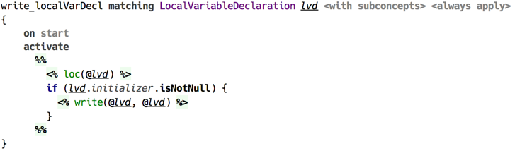  
_(example of rule with production template)_

A handler is a concept in language `jetbrains.mps.lang.coderules`.

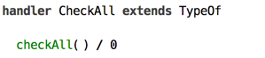  
_(example of a handler declaration — without contents)_

Keyword `extends` allows to specify another handler, which is to be extended. All constraint productions generated by rules in this handler will have higher priority. This enables to override the original handler’s behaviour.

Only declared constraints are allowed to be used in the heads of productions in rules of this handler or its extensions. Handler should declare one or more constraints, unless it only uses the constraints from handlers which it extends. Constraint declaration consists of name and *arity*, which together constitute a *constraint symbol*. Constraint’s arity is fixed.

Rules can specify applicable concept, either exactly or including its subconcepts. One can also declare *standalone* rules, which are triggered automatically on every rules application.

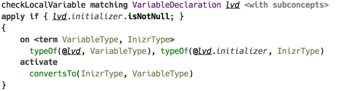  
_(example of rule matching concept instances with condition block)_

An applicability condition, if specified, is checked before applying the rule.

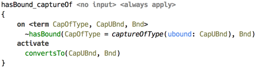  
_(example of standalone rule without input)_

Contents of a rule is a block of code that gets executed when the rule is applied to the source model. If the input is specified, the declared parameter is available in the body. When no input is specified, the rule becomes «standalone» and is automatically executed once per every rules application.

Rules may affect the scope of model locations that are processed during the application session. Suppose a production responsible for typechecking a location relies on presence of productions that are only available if some other location is processed as well. To guarantee that a certain model location is processed during the application session one uses `require` statement. 

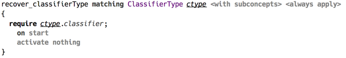  
_(example of using `require` statement)_

#### Constraint Productions

*Constraint productions* can be created at any place within rule body. A production has three main parts called head, guard, and body. The head defines what constraint trigger this production, and it can only contain constraints defined by the handler or one of the handlers it extends. The body can contain any visible constraints, as well as *predicates*. A production must include either the body or the head, no production can omit both. The guard is optional, and it can only contain predicates.

Both the head and the body can declare *logical variables*. By default a logical variable ranges over *terms*, although any POJO may be serve as a value.

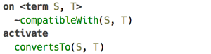  
_(constraint production declaring logical variables)_

A production with an empty head, not declaring any constraints to serve as the input, is considered an *automatic* production and is triggered automatically on start of constraints program evaluation.

In production’s head constraints can be declared as either *kept* or *replaced*. Briefly put, the constraints that are *kept* are left alone after a production is fired, whereas the *replaced* ones are discarded after the head has been matched. Replaced constraints are marked with tilde `~`.

A production is triggered when there are constraint occurrences matching all constraints in production’s head. When a constraint with logical variable as one of its arguments is matched, that variable becomes bound to the corresponding argument of the matching occurrence. The scope of the binding is this production’s guard and body.

Pattern matching is also possible with terms, optionally containing logical variables, serving as patterns. For this to work, a logical variable that serves as a constraint argument should have a pattern attached.  

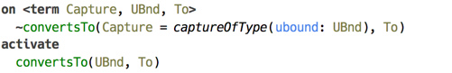  
_(production with pattern matching)_

Everywhere where locations in the source code (model) must be referenced, node references are used, which are introduced with the `@` symbol.

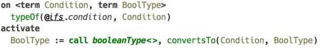  
_(example of constraint argument referring to a location)_

Whereas the production’s head can only contain constraints, there are also other logical clauses that are used in guard and body.

A *predicate* is a built-in construct that serves two purposes: when used in guard, it serves to query if the condition is satisfied, and when invoked from body, it asserts the condition. An example is `unifies` predicate, displayed as `=`, which tests if its arguments can be unified if used in guard, and invokes the actual unification if called from body. There are also predicates that can only be queries, such as `isFree/1` or `isBound/1`, testing if a logical variable is free or has value assigned.

Production’s guard can only contain predicates, and the body can contain both constraints and predicates.  

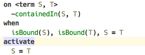  
_(`unifies` predicate used in the guard and in the body)_

Arbitrary Java code can be called with `eval/1` predicate. It accepts either an expression of `boolean` type, in which case it can be used in guard, or expression of any type, such as static method call, which is available in body.

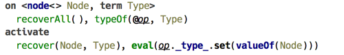  
_(example of using `eval()` predicate)_

***Expand/call pseudo predicates***

***Code templates within production body***

***Alternative body***

#### Query

Query is the entry point to a constraint program. The only purpose of a query is to activate constraints that trigger computation implemented by constraint productions.

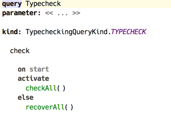  
_(example of a query)_

A query is discovered by the API through its *kind*. Query kind specifies parameters that can be passed to it. The body of a query can contain same constraints and predicates as regular constraints production.

#### Macro table

Macros allow to have parameterised constructors for terms. They can either create terms using nodes coming from the source model, or use the parameters to fill in values. By contrast with rules, macros are always explicitly invoked.

This feature may come in handy when data types used by the constraint program are complicated and include many levels of containment. For example, type checking with *code rules* relies on types being terms, which means types can contain other types.

Macros are defined in a root `Macro table`. Its contents is made of *macro definitions*.

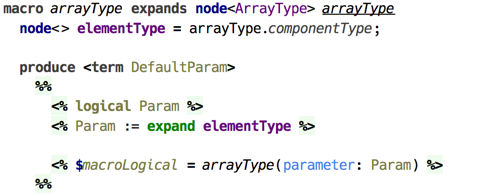  
_(macro definition in a macro table)_

Macro *expands* instances of specified concept. This means the macro can be invoked on an instance of this concept. In case macro is *expanded*, its parameters are automatically initialised to appropriate values. Otherwise, a macro can be directly *called* with parameters specified explicitly.

***Expand/call from production body***

- Macro body is a code template, with every constraint or predicate produced from this template being inserted into the production body at the invocation site. There is a special logical variable available within macro body, `macroLogical`, which captures the logical variable on the left side of `expand` or `call` predicate.

***Substitutions***

#### DataForm table

DataForm table contains *dataform* declarations, a.k.a. *terms*. A term is a simple recursive data type that is suitable for implementing unification. Also, terms can model any other data structure, in particular they are suitable for representing types in a programming language.

Dataform is defined by its symbol and its features, which can be a POJO, a child dataform, or a list of dataforms. A feature may have a default value provider. A dataform extending another dataform adds new features or provides default values for existing ones.

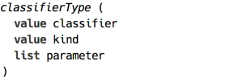  
_(example of a dataform definition for classifier type)_

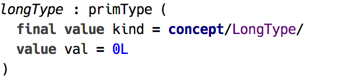  
_(examples of dataform definition for long type)_

***Terms***

[^dft]: this concept is defined in another language, `jetbrains.mps.logic`
