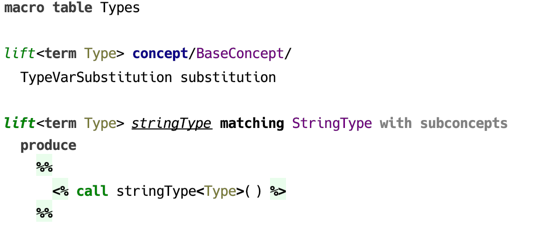
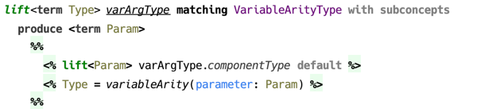
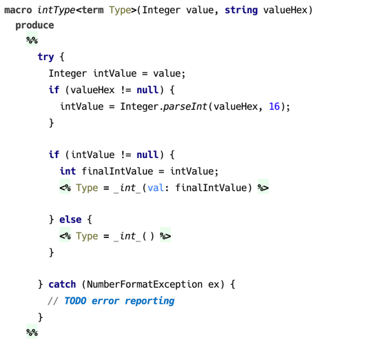
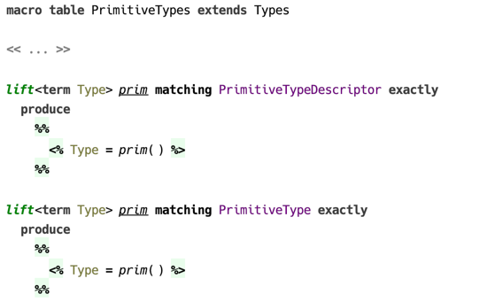

### Macro table

The motivation behind using macros, and — in a wider context — behind using terms as datatype, is that sometimes it takes more than just an SNode to represent a type. For example, in order to find a solution for a type inference problem, a logical variable representing the inference variable requires a bound, implemented is a constraint on that variable. In other situations, a newly constructed type has to substitute type variables with some other types. It is only convenient to extract such functionality into a separate, reusable fragment.

The two kinds of macros — `expand` and `call` — are provided to refactor portions of constraint rule templates by introducing reusable fragments. Both kinds of macros are only available in *body* part of constraint rule templates. 

#### Expand macro

Expand macro has access to SNode instance on which it was invoked, can access the optional parameters, and either use or assign the logical variables. By contrast with rules, expand macros are always explicitly invoked.

Expand macro declaration must define the applicable concept. It may also contain one or several parameters, which are optionally provided at the usage site and are made available to instances of the macro.
 
   
 _(example of an expand macro declaration)_
 
Logical variables declared in angle brackets right after the name of the macro are used to pass IN and OUT parameters. In addition, a macro can define its own logical variables.
 
A specific expand macro is always applicable to SNode instances of particular concept that must extend the concept in the macro declaration, which it refers.
 
Expand macro can be applied recursively to provide more fine-grained reusability. 
 
  
_(example of a recursive expand macro)_

***Substitution — passing parameters via context***

#### Call macro

A call macro can be most simply described as a method accepting one or several parameters and a list of logical variables. A call macro can be invoked from a constraint rule’s body, as well as from an expand macro or another call macro. 

  
_(example of a call macro declaration)_

#### Macro table extensibility

A macro table is able to extend other macro table in order to provide definitions of *expand* macros.

  
_(example of a macro table that extends another macro table)_