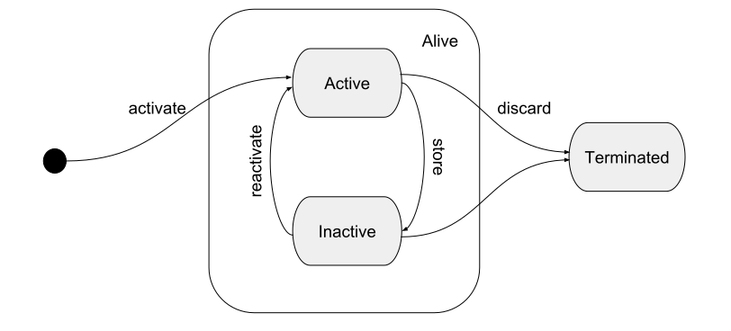
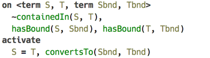

# Constraints Processing System

This section briefly overviews how constraints processing works. The system described here follows loosely the CHR specification, and has been in particular heavily influenced by JCHR[^jchr] implementation. The distinctive features are built-in support for logical variables, terms, and pattern matching. Alternative body branches are a deviation from the standard CHR.

### Terms and unification

Constraints processing relies heavily on the use of *terms* as data type. Abstractly speaking, terms are functions of zero or more arguments. Any opaque value captured by a term must be a POJO.

```
  f(g(), h(k()))

  p(val("foo"), q())

  node(name("List"), arg(node(name("Int"), arg())))
```
_(examples of terms)_

The unique feature of terms is that they support unification. Unification of two terms is possible with or without *variables* being used as subterms of either participant, but in the latter case the two terms must be equal.

A term variable ranges over terms. A substitution is a mapping of variables to terms. Unification searches for a substitution $\sigma$, such that for two terms being unified, $f$ and $g$, the following holds: $\sigma f = \sigma g$.

```
  [X -> g()] unifies f(X, h(X)) and f(g(), h(g()))

  f(X, h(X)) and f(g(), h(k())) can't be unified
```

Pattern matching is possible when variables are only used by one of the terms, which is then serves as pattern. To test if a pattern matches a given term can be implemented by a linear time algorithm, whereas full unification is slightly more complicated.

***MGU***

***Occurrs check***

### Logical variables

Logical variables serve to identify an object that is to be determined in the future. They are *monotonic*, in the sense that once a variable is assigned a particular value, it stays assigned to that value. In addition, they implement a *union-find data structure*[^uf] a.k.a. “disjoint set”. Any free logical variable can be assigned a class by setting its “parent” field to point to the class’s representative. All logical variables belonging to the same class are treated as exactly one variable. Logical variables notify observers when they become ground and when their *parent* (class representative) changes.

```
  val X = Logical("X")
  val Y = Logical("Y")

  assertTrue(X.isFree() && y.isFree())

  X.set("foo")
  assertTrue(X.value() == "foo"))

  Y.union(X)

  assertTrue(Y.find() == X)
  assertTrue(Y.find().value() == "foo")
```
_(example of using logical variables)_

A term variable can also be a logical variable, so that when two terms are unified, the substitution already has the calculated value for that variable.

```
  val X = Logical("X")
  val t1 = term("f", var(X), term("g", var(X)))
  val t2 = term("f", term("h"), term("g", term("h")))

  assertTrue(X.isFree())

  val substitution = t1.unify(t2)

  assertTrue(substitution.isValid())
  assertTrue(X.find().value() == term("h"))
```

### Constraints and predicates

Constraints are, simply put, tuples with fixed arity and a symbol attached. In some respects constraints correspond to rows in a database table. Logically they can be understood as facts, relations, or propositions. An argument to a constraint can be a term, a logical variable, or any POJO, except another constraint.

Constraints are activated from a production’s body and stay active until there are no possible matches with any of productions’s heads. If a constraint is not discarded by a production, it is stored for future use. Stored constraints represent the program’s state.

The following figure shows the lifecycle of a constraint. The big rounded square in the middle contains the states, in which a constraint is considered “alive”: it can be either “active” or “stored”, but available for filling up vacant positions in a production’s head. A stored constraint can be reactivated if one of its arguments changes, such as when a logical variable becomes ground.

A successfully fired production, which declares one or more of constraints in its head to be “replaced”, causes these to be terminated.

  
_(lifecycle of a constraint)_

#### Predicates

Whereas a constraint serves to embody a fact or a relation among objects simply by being a witness of such a fact or a relation, a *predicate*[^pred] helps to establish a fact or a relation, or check if one exists, by means of executing a procedure. Same is true for facts and propositions.

Predicates must implement ask/tell protocol. If a predicate is invoked from production’s guard clause, it represents a query (ask), and if it is invoked from the body, it is an assertion (tell).

***Example of a predicate***

***Example of ask/tell***

### Constraint productions

Constraints program is built from productions. Each production has three parts: the part that is responsible for triggering the production, called “head”, the part that checks for pre-conditions, called “guard”, and the part that is evaluated when production is fired, which is called “body”.

#### Head

Head is a set of constraints which are all required to be alive in order for production to fire. This set is divided into “kept” part and “replaced” part, the latter containing constraints that are to be discarded as soon as the production fires.

A production is triggered when there are constraint occurrences matching all constraints specified in production’s head. These occurrences include the active constraint, plus any additional matching constraints that are currently alive, filling the other vacant slots.

There is some terminology inherited from CHR that can be useful when discussing the kinds of productions. In the following table `E` and `E'` are the set of constraints in production’s head, `C` is a conjunction of predicates serving as guard, and `G` is a conjunction of predicates and constraints in production’s body.

| “kept” set `E` | “replaced” set `E’` | Notation | Designation |
|:--|:--|:--:|:--|
| empty | non-empty | `E’ <=> C | G` | Simplification |
| non-empty | empty | `E => C | G` | Propagation |
| non-empty | non-empty | `E \ E’ <=> C | G` | Simpagation |

Essentially, a production with only “kept” constraints in its head is a “propagation”, the one with only “replaced” constraints is a “simplification”, and the one that has both “kept” and “replaced” constraints is a combination of the two.

In addition, we define a fourth kind of production, an “auto” production with an empty head. As the name implies, such production is triggered automatically on start of constraints program execution.
To illustrate the idea of using *stored* constraints to fill vacant positions when matching a production, let’s consider an example — a production resolving `containedIn/2` constraint, which corresponds to *type parameter containment* relation of BaseLanguage types.

  
_(example of a multi-head production)_

When `containedIn/2` constraint is activated, the production above matches, but two slots in its head must be filled in order for production to fire. The processor looks in the *store* for all *different* occurrences of constraint `hasBound/2` that could be matched, and substitutes them in these slots. The production will be fired for every matching triple of constraints.

#### Guard

Guard is a conjunction of predicates, which are checked before a production is fired. Predicates in a guard are *queried*.

#### Body

Body is a conjunction of predicates and constraint activations. When triggered, each body clause is evaluated in order, with predicates serving as *assertions* and constraint activations producing new constraints. Each newly activated constraint is checked against any productions that can be fired, and so on.


***Alternative body***

## Semantics of constraints program

The paper by Betz and Frühwirth[^lls] gives an excellent tretise on semantics of CHR using *linear logic*. Since our constraints processing system is based on CHR, this semantics is valid for it also.

Linear logic abandons boolean values and replaces them with consumable resources. Consequently, it introduces its own set of connectives, from which we are interested only in the following: $!,\otimes,\multimap$. The *multiplicative conjunction* $\otimes$ combines two or more resources that are all available at the same time. The symbol $!$ (*of course*) marks a resource that can’t be exhausted. And instead of implication $\rightarrow$ one uses $\multimap$ symbol, the meaning of which is a transformation of one resource to another. The formula $A \multimap B$ is read: “consuming $A$, produce $B$ ”, that is given a resource $A$, we can assume $B$, but $A$ can no longer be used.

Simplification is represented by a proposition stating that from valid guard condition $C$, which can be reused, we can imply the following: given the set of constraints $E$ matching the production’s left-hand side, we can find such substitution $\sigma$, such that we can now assume the set of constraints produced from production’s body: $\sigma G$. All free variables in this proposition are universally quantified and the proposition itself can be reused infinitely.

\\[  (E \Leftrightarrow C | G)^L :=
         !\forall((!C^L) \multimap
             (E^L \multimap \exists\bar{y}G^L)) \\]

Propagation is different from simplification in that the set of constraints $E$, which triggered the production, is made available together with the constraints produced by the body, so the constraints in $E$ are not “consumed”.

\\[  (E \Rightarrow C | G)^L :=
         !\forall((!C^L) \multimap
             (E^L \multimap E^L\otimes\exists\bar{y}G^L)) \\]


[^jchr]: K.U.Leuven JCHR System [https://dtai.cs.kuleuven.be/CHR/JCHR/](https://dtai.cs.kuleuven.be/CHR/JCHR/)
[^uf]: [https://en.wikipedia.org/wiki/Disjoint-set_data_structure](https://en.wikipedia.org/wiki/Disjoint-set_data_structure)
[^pred]: a.k.a. “built-in constraints” in CHR literature
[^lls]: Betz, H. and Frühwirth, T., 2005, October. A linear-logic semantics for constraint handling rules. In International Conference on Principles and Practice of Constraint Programming (pp. 137-151). Springer, Berlin, Heidelberg.
