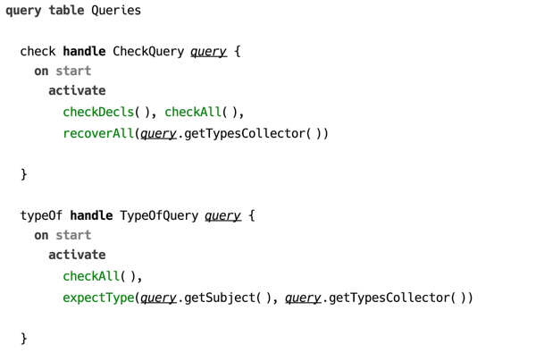
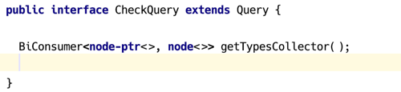

### Query table

Query is the entry point to a CodeRules program. The only purpose of a query is to activate constraints that trigger computations necessary for the query logic. Essentially a query is a limited constraint rule that only has the *body* part.

  
_(example of a query)_

A query is discovered by the API through its *kind*, which is specific to the language aspect, and which is represented as a Java interface. Query declares its kind in the **handle** section. The body of a query can contain same constraints and predicates as regular constraint rules.

  
_(example of a query interface)_
