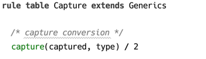
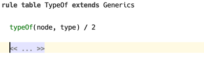
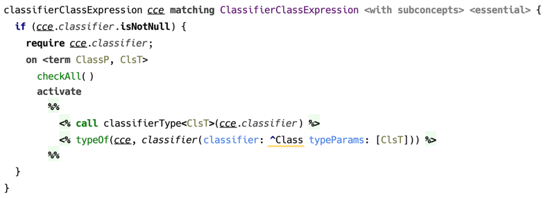
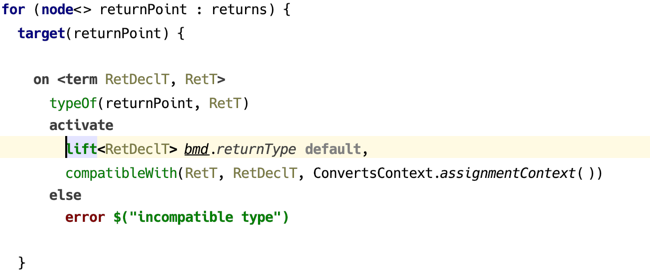
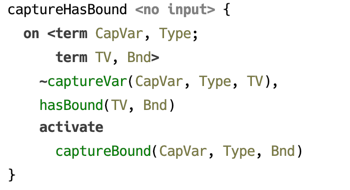
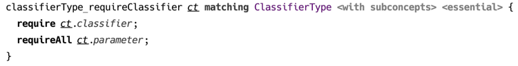

### Rule Table

#### Constraint declarations

Constraints declared by a rule table are public symbols that serve as its API in the following sense. In the *head* of constraint rules of a rule table and its extensions, only those constraints can be used that were declared in this rule table or any rule table it extends. On the other hand, any constraints can be used in *body*, provided the references to constraint declarations are resolved in the usual way.

#### Rule templates

Rule templates defined in rule tables are responsible for implementing the logic of checking the types (or other kind of code analysis), for which they may contribute constraint rules. These are created with a DSL that allows mixing constraints and Java code, and can also include constraint fragments inside a constraint rule template.

A rule table is a concept in language `jetbrains.mps.lang.coderules`.

  
_(example of a rule table declaration — without contents)_

Keyword `extends` allows to specify another rule table that is to be extended. All constraint rules generated by templates in this rule table will have higher priority. This enables to override the original rule table’s behaviour.

The following example demonstrates how a constraint rule’s body is constructed using a template. A body template is enclosed into a pair of `%% … %%` symbols and yields constraints wrapped into special `<% … %>` brackets.

  
_(example of constraint rule with body template)_

As demonstrated above, a constraint rule can be created depending on the result of evaluating a condition expression. Constraint rules can also be created in a cycle.

Only declared constraints are allowed to be used in the heads of constraint rules in the rule table declaring the constraint or the extensions of this rule table. Rule table should declare one or more constraints, unless it only uses the constraints from rule tables which it extends. Constraint declaration consists of name and *arity*, which together constitute a *constraint symbol*. Constraint’s arity is fixed.

Rule templates can specify applicable concept, either exactly or including its subconcepts. One can also declare *standalone* rules, which are applied automatically on every evaluation of CodeRules program.

  
_(example of standalone rule without input)_

Rule template’s contents is a block of code that gets executed when the rule is applied to the source model. If the input is specified, the declared parameter is available in rule’s body.

Rules may affect the scope of model locations that are processed during an evaluation session. Suppose a constraint rule responsible for type checking a particular location in source model relies on presence of constraint rules that are only available if some other location is processed as well. To guarantee that a certain model location is processed during the evaluation session, one uses `require` statement.

  
_(example of using `require` statement)_

This feature comes in handy for implementing a “partial” type checking (a.k.a. “local type checking”). Type checking may be launched either for a whole root, processing all AST tree recursively, in which case it may be called a “total” type checking, or it can be launched for a particular AST node in isolation, and this is then a “partial” type checking. In the latter case, there must be additional information provided by the type system author, which should serve to establish the necessary context by means of following the required dependencies. These may be method and class declarations, for example, if we are to check the type of a particular method parameter. 
