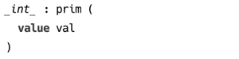
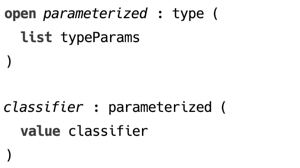
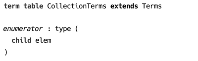

### Term table

Term table contains term declarations. A term is a simple recursive data type that is suitable for implementing unification. Also, terms can model any other data structure, in particular they are suitable for representing types in a programming language.

A term is defined by its symbol and its features, which can be a child term, a list of children terms or any Java object[^obj]. 

  
_(example of a term declaration)_

An *open* term declaration can be *extended* by another term, which helps implement a structural subtyping on terms. A term extending another term can add new features.

  
_(example of open term declaration)_

A instance of `classifier()` can always be matched with a pattern `parameterized()`, because the former structurally extends the latter.

A term table can extend another term table, in order  to provide extensions to existing terms. 

  
_(example of a term table extension)_

[^obj]: Java object conforming to equals/hashCode contract
