# Fitch system

This project demonstrates the use of type checking to validate proofs in [propositional logic](http://logic.stanford.edu/intrologic/glossary/propositional_logic.html). The proof system is [Fitch](http://logic.stanford.edu/intrologic/glossary/fitch_system.html).

This project is developed with [JetBrains MPS](https://www.jetbrains.com/mps/) using the [plugin](https://github.com/fisakov/constraints-typechecking) that provides an experimental feature: *type checking with constraint rules*.

### Instructions

1. Install the latest version of [JetBrains MPS](https://www.jetbrains.com/mps/download).
2. Download the type checking plugin from [this](https://github.com/fisakov/constraints-typechecking) project (follow the instructions there for installing the plugin using either update mechanism or manually)
3. Clone this repository and open the project with MPS
4. Execute 'Rebuild Project'

### Using the proof checker

Open a proof and invoke «Mark All Types» (Cmd+F7 on Mac). 


If the proof is valid, the goal is underlined with green, otherwise the goal and the reasoning(s) that have errors are marked with red. 

### Propositional logic language

The language enables to write boolean expressions and consists of propositional constants and the following logical operations: conjunction (And), disjunction (Or), negation (Not), implication (If), and biconditional (Iff). The following table summarises the operations and symbols that are used to represent them.

| Name | Logical operator | Symbol |
|:--|:--|:--|
| Conjunction | And | & |
| Disjunction | Or | \| |
| Negation | Not | ~ |
| Implication | If | => |
| Biconditional | Iff | <=> |

An example of sentence in propositional logic can be any of the following: 
````
p
q
(p & q)
p => q
(~p | q)
````

### Proof language 

Proofs in propositional logic are built from reasonings and subproofs. A reasoning always has a sentence serving as conclusion, and zero, one, or more bases (premises) that refer other reasonings. A subproof has a similar structure, with the exception that premises here always come in form of assumptions. Here is the list of proposition types: 

| Proposition | Number of bases | Usage |
|:--|:--|:--|
| Premise | 0 | Given as proof’s input |
| Assumption | 0 | Starts a subproof |
| Subproof | 0 | Enables to enter judgements that all share an assumption |
| Reiteration | 1 | Reinvokes a premise or an assumption available in the scope |
| Judgement | (depends on the rule) | Invokes an inference rule |

The rules of inference are defined by the [system](http://logic.stanford.edu/intrologic/glossary/fitch_system.html) being used and comprises ten rules: 

| Inference rule | Symbol| Number of bases of a judgement |
|:--|:--|:--|
| And Introduction | &I | 2 |
| And Elimination | &E | 1 |
| Or Introduction | \|I | 1 |
| Or Elimination | \|E | 3 |
| Negation Introduction | ~I | 2 |
| Negation Elimination | ~E | 1 |
| Implication Introduction | =>I | 1 (subproof) |
| Implication Elimination | =>E | 2 |
| Biconditional Introduction | <=>I | 2 |
| Biconditional Elimination | <=>E | 1 |

Here is a sample proof in propositional logic.


The proof is validated using experimental type checking with constraint rules, which is a new feature being developed for MPS. The sentences that constitute judgements in the proof are represented as *terms* in the internal language of constraint rules. The inference rules use *terms unification* to match sentences and extract sub-sentences. Every judgement is assigned a conclusion and, if the judgement is proved to be correct, it is marked as valid. 

Here is a sample of an inference rule written in the language of constraint rules processing.

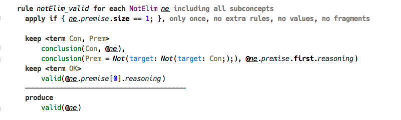

This rule is activated when **all** of the following is true:

- The judgement `ne` is assigned a conclusion (captured in `Con`)
- The judgement’s premise is assigned a conclusion 
- The premise’s conclusion matches `~~Con`
- The premise is valid

The result of the rule’s activation is simply that the judgement `ne` is marked as valid.

### Inner workings

Rule templates are applied to each of the reasoning nodes and produce a constraint rules program, that is then evaluated. First the automatic rules, the rules that are always generated, are triggered, which activate constraint `conclusion` binding reasoning to the propositional term corresponding to the sentence contained in the reasoning. 


Constraint `valid` signifies the validity of a reasoning. Premise and Assumption are valid automatically. Reiteration is valid if its conclusion matches the conclusion of the judgement being reiterated.

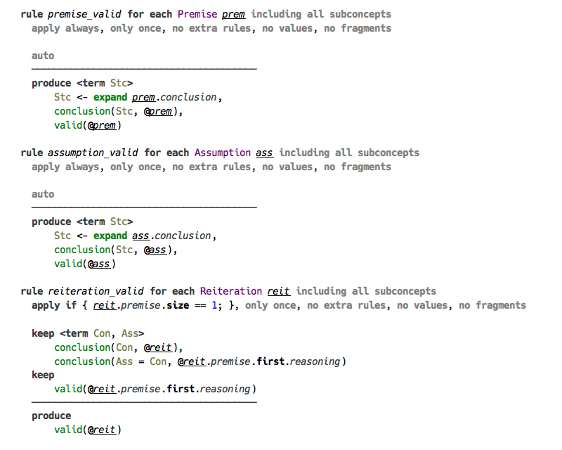

Activated constraints `conclusion` and `valid` trigger the rest of the constraint rules, which correspond to inference rules. 

The formal definition of And Introduction and And Elimination inference rules are the following. 


For simplicity, in this sample project we restrict ourselves to only two conjunctions, but we should account for premises being enumerated in any order. Here are the two inference rules for conjunction in the language of constraint rules. 

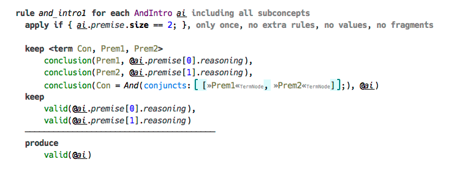
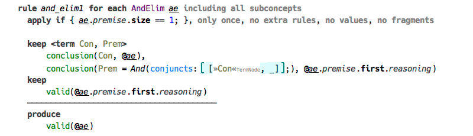

All inference rules are organised similarly: the premises (the part above the horizontal separator) are the input, which triggers the rule, and the conclusion is what the rule produces. All constraints in the input part are to be «kept», that is they are stored for future use by other rules after this rule completes. 


As with conjunction, we only support two disjunct in a disjunction, but their order can be arbitrary.

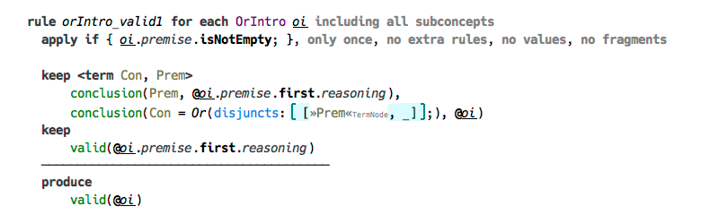

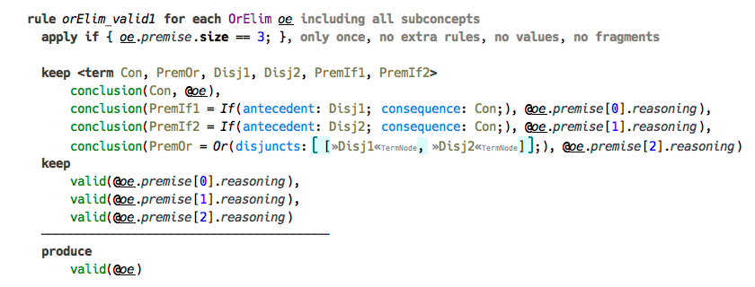


Negation introduction requires two premises, but their order is not specified, so we have two versions of an inference rule to account for this. There is only one version of Negation Elimination inference rule. 

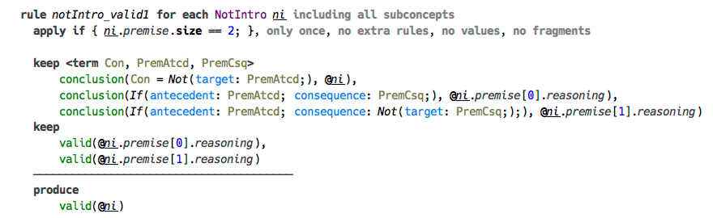

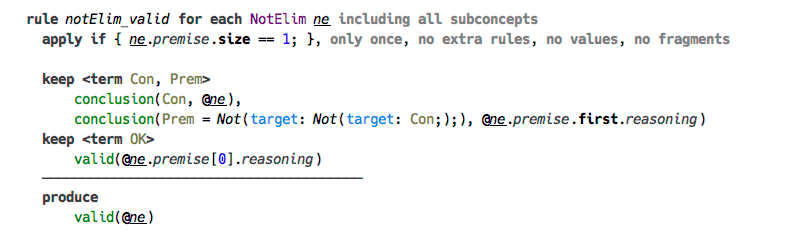


In the case of Implication Introduction the premise is not a judgement, but a subproof. We need to create one additional rule for the singular case, whereas the subproof serving as the premise has only the assumption. This is because we’re referring to both the first and the last judgments in the subproof, and the rule requires both to have a conclusion in the form of a constraint, which in the case of a singular assumption is the same constraint.  

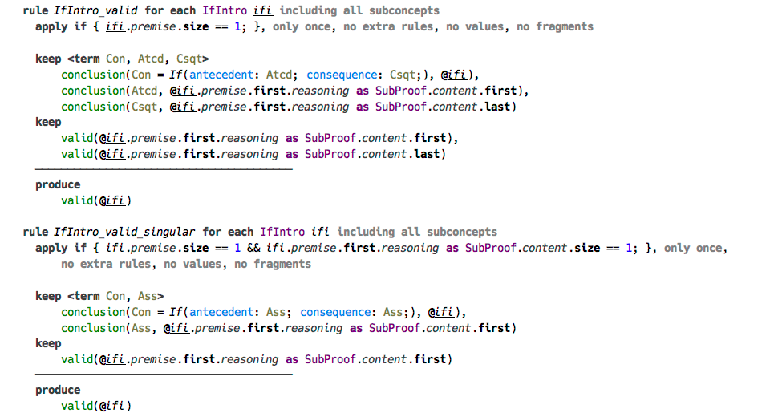

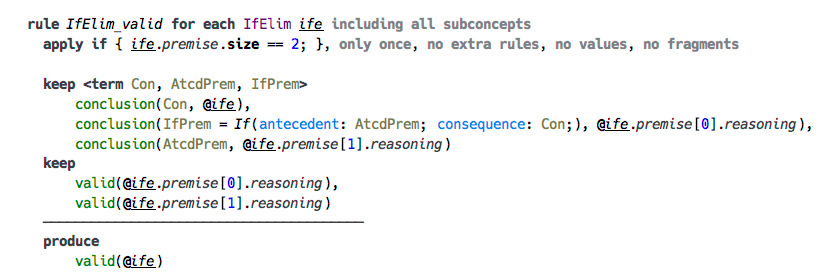

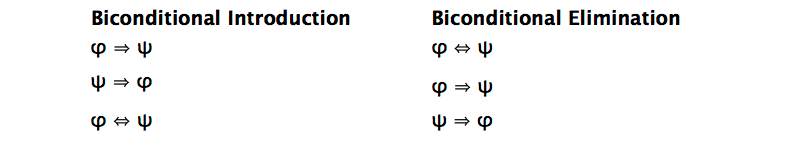

We create two versions of both Biconditional Introduction and Biconditional Elimination rules to account for arbitrary order of premises and arbitrary selection of the conclusion.

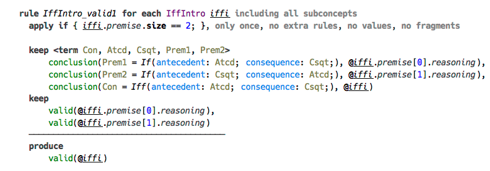

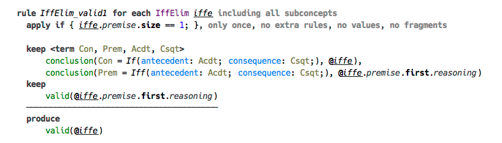


The constraint `goal` is activated automatically to associate the goal of the proof with its formal sentence.

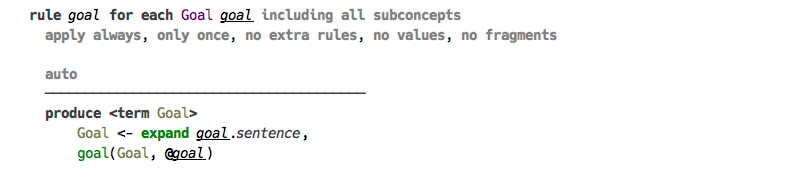

The proof’s goal is unified with the last **top-level** reasoning. Since reasonings are organised in a hierarchy using subproofs, the last reasoning in the proof is automatically the last top-level one. If that reasoning is marked valid, so is the goal.

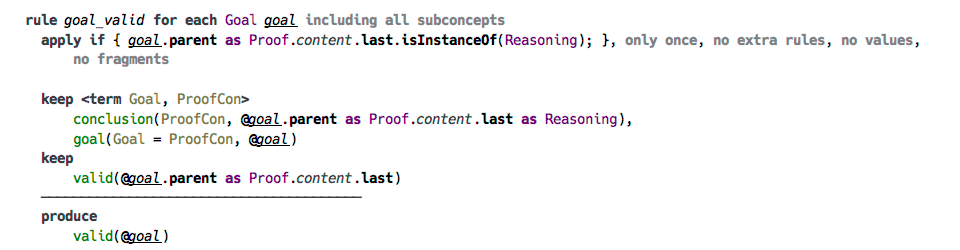

### Type checking

The actual type checking is trivial. The first stage of the constraint rules program does all the job and produces `valid` constraints, which are to be analysed in the second stage. All reasonings are checked in the second stage, and the reasonings that don’t have `valid` constraint are marked with error. 

There is only one type «OK». Only the goal gets assigned a type in case it marked as `valid`, otherwise an error is produced. 
